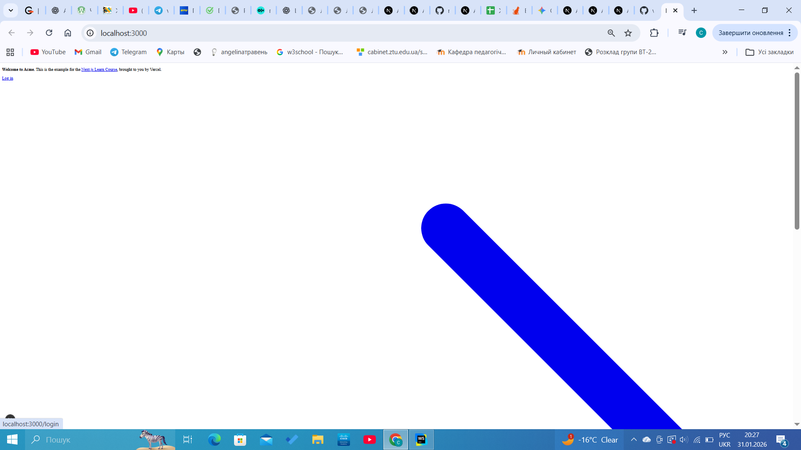
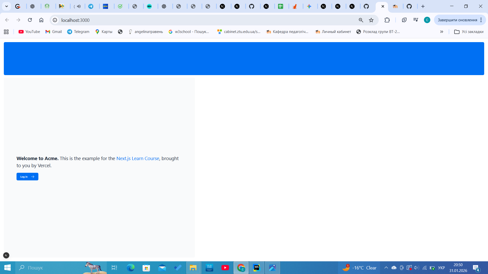
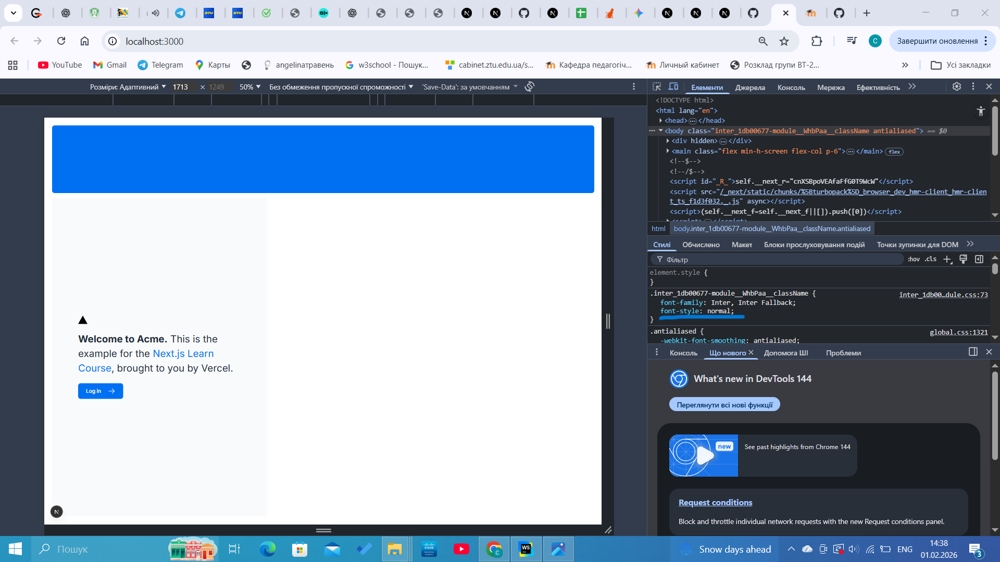

## Chapter 1

**Що було зроблено:**

- Створила проект і розібралась зі структурою проекту

**Роздуми:**

Цікаво, що Next.js використовує файлову систему для роутингу. Це набагато зручніше, ніж прописувати кожен шлях вручну в окремому конфігу.

****
## Chapter 2

**Що було зроблено:**

- Дослідила різні способи стилізації: Tailwind та CSS-модулі, дізналась про бібліотеку яка дозволяє перемикати назви класів(clsx)

**Роздуми:**

Було цікаво порівняти використання Tailwind із класичним CSS. Мені сподобалось, що з Tailwind не потрібно постійно перемикатися між файлом компонента та файлом стилів — усе пишеться прямо в className. Це значно пришвидшує розробку, хоча спочатку велика кількість класів виглядає дещо незвично

****
## Chapter 3

**Що було зроблено:**
- Налаштувала авто-завантаження Google Fonts через `next/font/google`, що дозволяє уникати мережевих запитів під час завантаження сторінки.
- Впровадила компонент `<Image>` для головних зображень (hero images).
- Реалізувала адаптивне відображення: на десктопах показується `hero-desktop.png`, а на мобільних пристроях — `hero-mobile.png`.

.png)

**Роздуми:**

Використання компонента `<Image>` замість звичайного `` виглядає як "магія" автоматизації: Next.js сам робить картинки адаптивними, конвертує їх у сучасні формати (як WebP) і завантажує лише тоді, коли вони потрапляють у поле зору користувача (lazy loading). Це набагато зручніше, ніж вручну оптимізувати кожен файл у Photoshop чи прописувати складні медіа-запити в CSS. Також цікаво було дізнатися, що Next.js хостить шрифти локально, що робить сайт незалежним від швидкості з'єднання з серверами Google.

****

## Chapter 4

**Що було зроблено:**
- Створила спеціальний файл `layout.tsx` для розділу `/dashboard`.
- Розібралася, як працює пропс `{children}` для виведення контенту сторінок.

.png)

**Роздуми:**
Концепція макетів у Next.js дуже нагадує матрьошку. Кореневий макет (Root Layout) керує всім додатком, а вкладені макети дозволяють створювати специфічні інтерфейси для окремих розділів. Найбільше сподобалася фішка з "частковим рендерингом" — те, що бокове меню не перевантажується при переході між сторінками. Це робить сайт схожим на мобільний додаток, де навігація миттєва і плавна. Також це економить ресурси, бо сервер не перераховує те, що не змінилося.

****
## Chapter 5

**Що було зроблено:**
- Замінила стандартні HTML-теги  a на компонент Link для швидкої навігації без перезавантаження сторінки.
- Впровадила хук usePathname() для отримання поточного шляху в URL.
- Налаштувала динамічну підсвітку активного посилання в меню за допомогою бібліотеки clsx.

.png)

**Роздуми:**
Найбільшим відкриттям у цьому розділі для мене стало те, як Next.js оптимізує переходи між сторінками. Використання <Link /> замість звичайних посилань робить сайт неймовірно швидким завдяки автоматичному розділенню коду (Code Splitting) та попередньому завантаженню (Prefetching).
Було цікаво змінити колір активного посилання — це допомогло зрозуміти, як логіка JavaScript (pathname === link.href) взаємодіє зі стилями Tailwind. Також я зрозуміла різницю між серверними та клієнтськими компонентами: оскільки нам потрібно стежити за станом браузера (шляхом в URL), ми обов'язково маємо використовувати директиву 'use client'. Це перетворює статичну сторінку на справжній інтерактивний застосунок.

****
## Chapter 6

**Що було зроблено:**

- Створила репозиторій на GitHub та підключила його до платформи Vercel.
- Розгорнула проєкт на Vercel із автоматичним деплоєм при кожному пуші в main-гілку.
- Створила та підключила базу даних PostgreSQL через інтеграцію Vercel (Neon / Supabase).
- Налаштувала змінні середовища у файлі .env та додала його до .gitignore для безпеки.
- Заповнила базу даних початковими даними за допомогою seed-скрипта.
- Виконала SQL-запит для перевірки коректності роботи бази даних та звʼязків між таблицями.

.png)
.png)

**Роздуми:**
У цьому розділі я краще зрозуміла, як фронтенд-застосунок взаємодіє з реальною базою даних. Найважливішим для мене стало усвідомлення ролі змінних середовища — вони дозволяють безпечно підключатися до бази даних, не розкриваючи конфіденційні дані в репозиторії.
Цікавим моментом був процес seed-інгу бази даних: замість ручного створення таблиць і записів використовується автоматичний скрипт, який створює структуру бази та наповнює її тестовими даними. Це значно спрощує розробку та тестування застосунку.
Також я зрозуміла, як Next.js працює з серверними маршрутами (route.ts) для виконання SQL-запитів. Це показало, що Next.js — це не лише про UI, а й повноцінний інструмент для роботи з бекенд-логікою. Перевірка даних через SQL-запит допомогла закріпити розуміння звʼязків між таблицями та принципів роботи реляційних баз даних.

****

## Chapter 7

**Що було зроблено:**

- Реалізовано функції для отримання даних із бази даних за допомогою SQL-запитів.
- Створено серверні функції для вибірки інформації про користувачів, рахунки та транзакції.
- Підключено отримані дані до компонентів сторінок інформаційної панелі (Dashboard).
- Реалізовано відображення статистики та таблиць на основі даних з бази.
- Оптимізовано завантаження даних за допомогою серверних компонентів Next.js.

.png)

**Роздуми:**
У цьому розділі я краще зрозуміла, як саме відбувається отримання даних із бази та їх подальше відображення в інтерфейсі користувача. Важливим моментом стало використання серверних компонентів, які дозволяють виконувати SQL-запити безпосередньо на сервері, не передаючи зайву логіку на клієнт.

Особливо корисним було розділення логіки: отримання даних відбувається у спеціальних функціях, а компоненти відповідають лише за відображення інформації. Це робить код більш зрозумілим, читабельним і легким для підтримки.

Також я усвідомила переваги асинхронної роботи з даними, оскільки вона дозволяє ефективно обробляти запити до бази даних і уникати блокування інтерфейсу.
