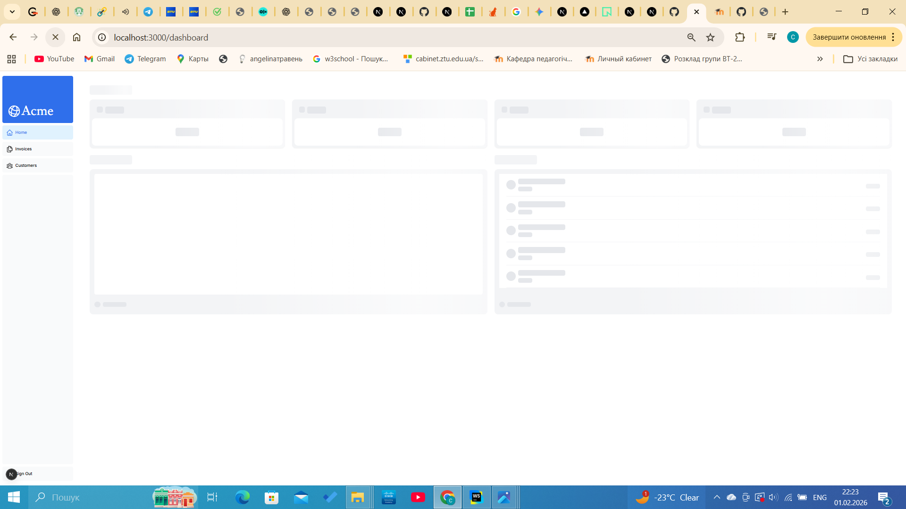
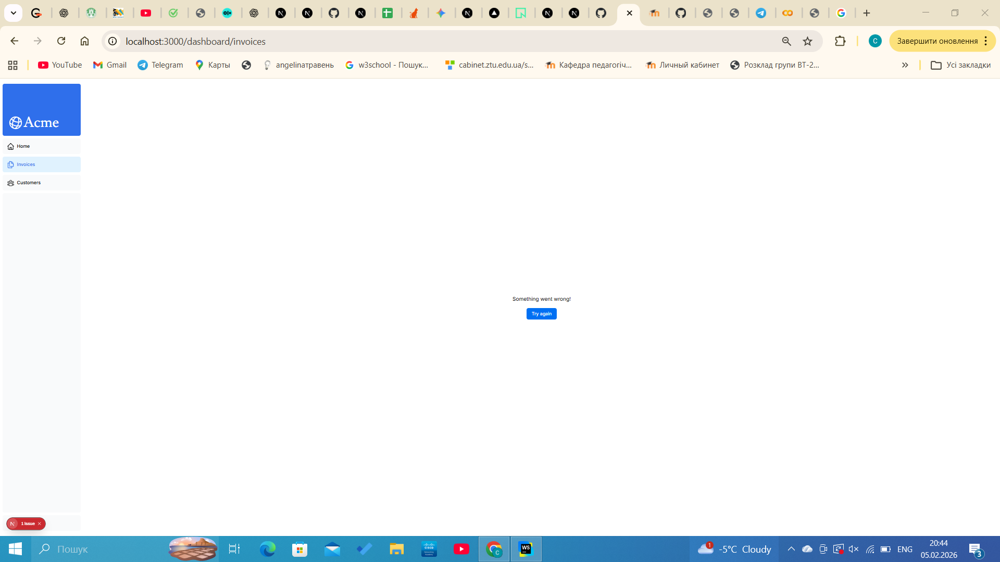

## Chapter 1

**Що було зроблено:**

- Створила проект і розібралась зі структурою проекту

**Роздуми:**

Цікаво, що Next.js використовує файлову систему для роутингу. Це набагато зручніше, ніж прописувати кожен шлях вручну в окремому конфігу.

****
## Chapter 2

**Що було зроблено:**

- Дослідила різні способи стилізації: Tailwind та CSS-модулі, дізналась про бібліотеку яка дозволяє перемикати назви класів(clsx)

**Роздуми:**

Було цікаво порівняти використання Tailwind із класичним CSS. Мені сподобалось, що з Tailwind не потрібно постійно перемикатися між файлом компонента та файлом стилів — усе пишеться прямо в className. Це значно пришвидшує розробку, хоча спочатку велика кількість класів виглядає дещо незвично

****
## Chapter 3

**Що було зроблено:**
- Налаштувала авто-завантаження Google Fonts через `next/font/google`, що дозволяє уникати мережевих запитів під час завантаження сторінки.
- Впровадила компонент `<Image>` для головних зображень (hero images).
- Реалізувала адаптивне відображення: на десктопах показується `hero-desktop.png`, а на мобільних пристроях — `hero-mobile.png`.

.png)

**Роздуми:**

Використання компонента `<Image>` замість звичайного `` виглядає як "магія" автоматизації: Next.js сам робить картинки адаптивними, конвертує їх у сучасні формати (як WebP) і завантажує лише тоді, коли вони потрапляють у поле зору користувача (lazy loading). Це набагато зручніше, ніж вручну оптимізувати кожен файл у Photoshop чи прописувати складні медіа-запити в CSS. Також цікаво було дізнатися, що Next.js хостить шрифти локально, що робить сайт незалежним від швидкості з'єднання з серверами Google.

****

## Chapter 4

**Що було зроблено:**
- Створила спеціальний файл `layout.tsx` для розділу `/dashboard`.
- Розібралася, як працює пропс `{children}` для виведення контенту сторінок.

.png)

**Роздуми:**
Концепція макетів у Next.js дуже нагадує матрьошку. Кореневий макет (Root Layout) керує всім додатком, а вкладені макети дозволяють створювати специфічні інтерфейси для окремих розділів. Найбільше сподобалася фішка з "частковим рендерингом" — те, що бокове меню не перевантажується при переході між сторінками. Це робить сайт схожим на мобільний додаток, де навігація миттєва і плавна. Також це економить ресурси, бо сервер не перераховує те, що не змінилося.

****
## Chapter 5

**Що було зроблено:**
- Замінила стандартні HTML-теги  a на компонент Link для швидкої навігації без перезавантаження сторінки.
- Впровадила хук usePathname() для отримання поточного шляху в URL.
- Налаштувала динамічну підсвітку активного посилання в меню за допомогою бібліотеки clsx.

.png)

**Роздуми:**
Найбільшим відкриттям у цьому розділі для мене стало те, як Next.js оптимізує переходи між сторінками. Використання <Link /> замість звичайних посилань робить сайт неймовірно швидким завдяки автоматичному розділенню коду (Code Splitting) та попередньому завантаженню (Prefetching).
Було цікаво змінити колір активного посилання — це допомогло зрозуміти, як логіка JavaScript (pathname === link.href) взаємодіє зі стилями Tailwind. Також я зрозуміла різницю між серверними та клієнтськими компонентами: оскільки нам потрібно стежити за станом браузера (шляхом в URL), ми обов'язково маємо використовувати директиву 'use client'. Це перетворює статичну сторінку на справжній інтерактивний застосунок.

****
## Chapter 6

**Що було зроблено:**

- Створила репозиторій на GitHub та підключила його до платформи Vercel.
- Розгорнула проєкт на Vercel із автоматичним деплоєм при кожному пуші в main-гілку.
- Створила та підключила базу даних PostgreSQL через інтеграцію Vercel (Neon / Supabase).
- Налаштувала змінні середовища у файлі .env та додала його до .gitignore для безпеки.
- Заповнила базу даних початковими даними за допомогою seed-скрипта.
- Виконала SQL-запит для перевірки коректності роботи бази даних та звʼязків між таблицями.

.png)
.png)

**Роздуми:**
У цьому розділі я краще зрозуміла, як фронтенд-застосунок взаємодіє з реальною базою даних. Найважливішим для мене стало усвідомлення ролі змінних середовища — вони дозволяють безпечно підключатися до бази даних, не розкриваючи конфіденційні дані в репозиторії.
Цікавим моментом був процес seed-інгу бази даних: замість ручного створення таблиць і записів використовується автоматичний скрипт, який створює структуру бази та наповнює її тестовими даними. Це значно спрощує розробку та тестування застосунку.
Також я зрозуміла, як Next.js працює з серверними маршрутами (route.ts) для виконання SQL-запитів. Це показало, що Next.js — це не лише про UI, а й повноцінний інструмент для роботи з бекенд-логікою. Перевірка даних через SQL-запит допомогла закріпити розуміння звʼязків між таблицями та принципів роботи реляційних баз даних.

****

## Chapter 7

**Що було зроблено:**

- Реалізовано функції для отримання даних із бази даних за допомогою SQL-запитів.
- Створено серверні функції для вибірки інформації про користувачів, рахунки та транзакції.
- Підключено отримані дані до компонентів сторінок інформаційної панелі (Dashboard).
- Реалізовано відображення статистики та таблиць на основі даних з бази.
- Оптимізовано завантаження даних за допомогою серверних компонентів Next.js.

.png)

**Роздуми:**
У цьому розділі я краще зрозуміла, як саме відбувається отримання даних із бази та їх подальше відображення в інтерфейсі користувача. Важливим моментом стало використання серверних компонентів, які дозволяють виконувати SQL-запити безпосередньо на сервері, не передаючи зайву логіку на клієнт.

Особливо корисним було розділення логіки: отримання даних відбувається у спеціальних функціях, а компоненти відповідають лише за відображення інформації. Це робить код більш зрозумілим, читабельним і легким для підтримки.

Також я усвідомила переваги асинхронної роботи з даними, оскільки вона дозволяє ефективно обробляти запити до бази даних і уникати блокування інтерфейсу.

****

## Chapter 9

**Що було зроблено:**

- Ознайомилася з концепцією потокового передавання (streaming) у Next.js та його впливом на продуктивність застосунку.

- Реалізовано потокове передавання сторінки за допомогою спеціального файлу loading.tsx.

- Додано скелети завантаження (loading skeletons) для покращення користувацького досвіду під час повільного отримання даних.

- Використано групи маршрутів (Route Groups) для обмеження області застосування loading.tsx.

- Реалізовано потокове передавання окремих компонентів за допомогою React Suspense.

- Переміщено логіку отримання даних безпосередньо у компоненти, які їх використовують.

- Створено та використано компонент-обгортку для групування карток з метою одночасного завантаження.

- Визначено та налаштовано межі Suspense для досягнення поетапного відображення інтерфейсу.

**Роздуми:**

У цьому розділі я глибше зрозуміла, як Next.js працює з асинхронним рендерингом і як потокове передавання може суттєво покращити взаємодію з користувачем. Важливим відкриттям стало те, що сторінка не обовʼязково має чекати завершення всіх запитів до бази даних, перш ніж відобразити інтерфейс.

Особливо корисним було використання React Suspense, який дозволяє контролювати процес завантаження на рівні окремих компонентів. Переміщення запитів до компонентів, що безпосередньо потребують даних, зробило код більш гнучким і зрозумілим.

Також я усвідомила важливість правильного розміщення меж Suspense, оскільки від цього залежить сприйняття сторінки користувачем. Скелети завантаження допомагають зменшити відчуття очікування та роблять інтерфейс більш плавним і приємним.

****

## Chapter 10

**Що було зроблено:**

- Реалізовано функціонал пошуку та пагінації, використовуючи параметри URL-адреси (URL Search Params) як основне джерело стану додатка.

- Ознайомилася та застосувала на практиці клієнтські хуки Next.js: useSearchParams, usePathname та useRouter.

- Впровадила механізм Debouncing (усунення дребезгу) за допомогою бібліотеки use-debounce для оптимізації запитів до бази даних.

- Налаштувала синхронізацію стану пошукового запиту з полем введення через властивість defaultValue.

- Реалізовано логіку пагінації на стороні сервера, обчислюючи загальну кількість сторінок за допомогою функції fetchInvoicesPages.

.png)
.png)

**Роздуми:**

Цей розділ став ключовим у розумінні того, як створювати по-справжньому професійні та зручні для користувача інтерфейси. Головним відкриттям для мене стала перевага використання URL-параметрів замість звичайного клієнтського стейту (useState). Це не тільки дозволяє користувачам ділитися посиланнями на конкретні результати пошуку, але й спрощує аналітику та роботу з історією браузера.

Впровадження Debouncing було критично важливим моментом. Я зрозуміла, як легко можна випадково перевантажити базу даних частими запитами, і як всього кілька рядків коду можуть зробити додаток значно ефективнішим.

Також було цікаво працювати зі зв'язкою "Клієнт-Сервер": коли клієнтський компонент Search лише оновлює URL, а серверний компонент Table автоматично реагує на ці зміни та підтягує потрібні дані. Такий підхід робить архітектуру додатка чистою та надійною.

****

## Chapter 11

**Що було зроблено:**

- Опанувала концепцію React Server Actions для прямої мутації даних на сервері без створення окремих API-ендпоінтів.
- Створила повноцінний CRUD-цикл (Create, Read, Update, Delete) для рахунків-фактур.
- Використала бібліотеку Zod для суворої валідації типів та обробки даних із форм (FormData).
- Реалізувала динамічні сегменти маршрутів (Dynamic Routes) за допомогою структури папок [id] для редагування конкретних записів.
- Застосувала метод bind для передачі додаткових параметрів (наприклад, ID інвойсу) у серверні дії.
- Налаштувала автоматичне оновлення інтерфейсу за допомогою revalidatePath, що дозволяє очистити кеш на стороні клієнта після внесення змін.

.png)

.png)

.png)

.png)

.png)

**Роздуми:**

Одинадцятий розділ став для мене справжнім проривом у розумінні "Full-stack" природи Next.js. Раніше я звикла, що для будь-якої взаємодії з базою даних потрібно писати складні fetch запити на фронтенді та створювати контролери на бекенді. Server Actions повністю змінюють ці правила гри: тепер форма може викликати функцію безпосередньо в базі даних, що виглядає магічно і значно скорочує обсяг коду.

Особливо корисним було знайомство з Zod. Валідація даних "на льоту" та автоматичне приведення типів (як-от перетворення рядка в число через coerce) — це те, що робить додаток надійним і захищеним від некоректних вводів.

Також я оцінила перевагу використання UUID замість звичайних ID. Хоча посилання стають довшими, це дає відчуття безпеки та масштабованості архітектури.

****
## Chapter 12

**Що було зроблено:**

- Ознайомилася з механізмами обробки помилок у Next.js на рівні маршрутів та серверних дій.
- Додала обробку помилок у server actions за допомогою try/catch, щоб коректно реагувати на помилки бази даних та повертати зрозумілі повідомлення.
- Розібралася, як працює redirect у Next.js та чому його потрібно викликати поза блоком try/catch.
- Реалізувала файл error.tsx для перехоплення непередбачених помилок у сегментах маршруту та відображення fallback UI для користувача.
- Навчилася використовувати функцію reset() для повторної спроби рендерингу після помилки.
- Реалізувала коректну обробку помилок 404 за допомогою notFound() та файлу not-found.tsx.

.png)

**Роздуми:**

Цей розділ допоміг мені краще зрозуміти, наскільки важливою є коректна обробка помилок у реальних веб-додатках. Раніше я сприймала помилки просто як «щось пішло не так», але тепер чітко бачу різницю між очікуваними помилками (наприклад, відсутній ресурс) та неочікуваними винятками.

Особливо корисним було усвідомлення ролі error.tsx як універсальної межі помилок для маршруту. Це дозволяє не ламати весь додаток, а показувати користувачу зрозумілий і дружній інтерфейс.

Також важливим відкриттям стало використання notFound() замість загальної помилки — це робить UX набагато кращим і логічнішим. Користувач одразу розуміє, що проблема не в додатку, а в тому, що запитаний ресурс не існує.
